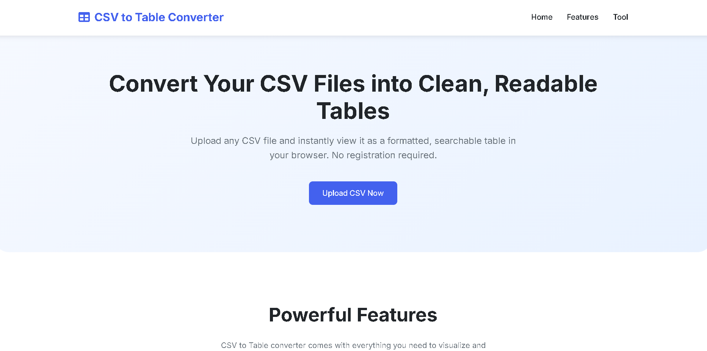

# CSV2Table – CSV to Table Converter  

Convert your CSV files into clean, readable tables right in your browser.  
No backend required — everything runs on **HTML, CSS, and JavaScript**.  


---

## Preview

 

---

## 🚀 Features
- 📂 Upload any CSV file from your computer  
- 🔎 Auto-format into a clean, responsive HTML table  
- 🎨 Simple and modern UI design  
- 💡 Runs entirely in your browser (no server needed)  
- 🔧 Open-source and open for contributions  

---

## 🛠️ Tech Stack
- **HTML5**  
- **CSS3 (Flexbox + Grid)**  
- **Vanilla JavaScript**  

---

## 📥 Getting Started

### Clone the Repository
```bash
git clone https://github.com/adinahawaldar/CSV2Table.git
cd CSV2Table
